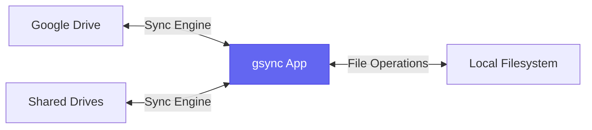
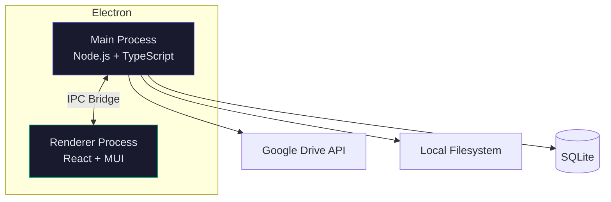

# gsync

A standalone desktop application for bidirectional Google Drive synchronization. Browse your drives, create sync profiles, and keep your files in sync with an elegant, daily-driver UI.



## Features

- **Google OAuth** -- Sign in securely; tokens stored locally in SQLite
- **Dual-pane file browser** -- Google Drive (personal + shared) on the left, local files on the right
- **Permission-aware sync** -- Detects read-only vs. read-write access and adjusts sync direction
- **Card-based sync profiles** -- Each sync job is a card with glowing progress indicators
- **Resumable transfers** -- Chunked uploads/downloads that resume after failures
- **Hash checksums** -- MD5 comparison to detect changes and determine which file is newer
- **Activity history** -- Full log of every sync operation with bytes transferred, duration, errors
- **Scheduling** -- Cron-like schedules or manual triggers per sync profile
- **Pause & Resume** -- Pause large transfers and resume later; partial downloads saved to disk
- **6 Themes** -- Midnight, GitHub Dark, Dracula, Nord, One Dark Pro, Light
- **Database backup** -- Backup/restore/merge settings to Google Drive
- **Auto-update** -- Built-in update mechanism via GitHub Releases
- **macOS-native feel** -- Hidden titlebar, traffic light integration, dark theme

## Quick Start

### Prerequisites

- Node.js 20+ and npm
- Google Cloud project with OAuth credentials ([setup guide](docs/oauth-setup.md))

### Install & Run

```bash
# Install dependencies
npm install

# Create .env with your Google OAuth credentials
cp .env.example .env
# Edit .env with your GOOGLE_CLIENT_ID and GOOGLE_CLIENT_SECRET

# Start in development mode
npm run dev
```

### Build for Distribution

```bash
npm run dist        # macOS .dmg + .zip
npm run dist:win    # Windows .exe
npm run dist:linux  # Linux .AppImage
npm run dist:all    # All platforms
```

### macOS Installation (unsigned)

Since the app is not code-signed, macOS Gatekeeper will block it. After installing:

```bash
xattr -rc /Applications/gsync.app
```

Or right-click the app and select **Open** to bypass Gatekeeper on first launch.

## Architecture



See [docs/architecture.md](docs/architecture.md) for the full architecture with IPC channel maps, database schema, and technology rationale.

## Project Structure

```
gdrive/
├── desktop/         # Electron main process
├── frontend/        # React renderer (Vite)
├── shared/          # Shared TypeScript types
├── docs/            # Architecture & setup docs
├── scripts/         # Utility scripts
├── .github/         # CI/CD workflows
└── dist/            # Build output
```

| Folder | Purpose |
|--------|---------|
| [`desktop/`](desktop/) | Electron main process: OAuth, Drive API, local filesystem, SQLite |
| [`frontend/`](frontend/) | React UI: Login, Dashboard, Drive/Local trees, Sync cards |
| [`shared/`](shared/) | TypeScript types shared between main and renderer |
| [`docs/`](docs/) | Architecture diagrams, OAuth setup guide, phase roadmap |
| [`scripts/`](scripts/) | Test and utility scripts |

## Documentation

| Document | Description |
|----------|-------------|
| [Architecture](docs/architecture.md) | System design, IPC channels, database schema, folder structure |
| [OAuth Setup](docs/oauth-setup.md) | Step-by-step Google Cloud credentials configuration |
| [Phases](docs/phases.md) | Implementation roadmap with deliverables per phase |

## Development

```bash
npm run dev           # Vite dev server + Electron (hot reload)
npm run build         # Compile TypeScript + bundle renderer
npm run dist          # Build + package as .dmg
```

### npm Scripts

| Script | Description |
|--------|-------------|
| `dev` | Start Vite + Electron concurrently |
| `dev:vite` | Start Vite dev server only |
| `dev:electron` | Compile main process + launch Electron |
| `build` | Production build (tsc + vite) |
| `dist` | Package macOS .dmg |
| `dist:all` | Package all platforms |

## Tech Stack

| Layer | Technology |
|-------|-----------|
| Desktop | Electron 33 |
| UI | React 18 + Material UI 5 |
| Build | Vite 6 + TypeScript 5 |
| APIs | googleapis (official Google client) |
| Database | SQLite via better-sqlite3 |
| Packaging | electron-builder |
| Updates | electron-updater + GitHub Releases |
| CI/CD | GitHub Actions |

## License

MIT
