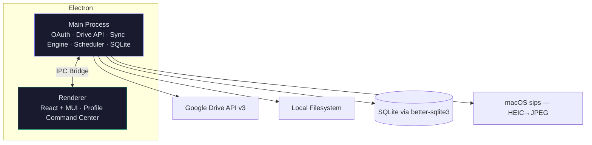

# gsync

A standalone Electron desktop app for syncing Google Drive with your local filesystem. Profile-centric design — create sync profiles, monitor status, and let gsync handle the rest.


| Home — Profile Command Center | Quick Sync — Multi-folder Selection |
|:---:|:---:|
|  |  |

| Sync History | Settings & Themes |
|:---:|:---:|
|  |  |

## Features

| Feature | Description |
|---------|-------------|
| **Profile Command Center** | Master-detail layout — profile list on the left, live detail on the right |
| **Quick Sync** | Multi-select Drive or local folders, batch-create profiles in one wizard |
| **Google OAuth** | System browser sign-in — passkeys, autofill, 2FA all work |
| **Bidirectional Sync** | Download, upload, or bidirectional per profile |
| **Mirror Mode** | Delete extras on destination to make an exact copy |
| **MD5 Checksums** | Only transfers changed files — compares hashes before downloading |
| **Stop & Resume** | Stop large transfers mid-sync; partial files saved for resume |
| **HEIC to JPEG** | Auto-convert iPhone photos to JPEG during sync |
| **Google Workspace Export** | Docs→DOCX, Sheets→XLSX, Slides→PPTX, Drawings→PNG |
| **Shared with Me** | Browse shared files bucketed by This Week / This Month / older |
| **Scheduled Auto-Sync** | Every 1m, 2m, 5m, 15m, 30m, hourly, daily, or custom cron |
| **Active/Inactive Toggle** | Pause a profile's schedule without deleting it |
| **File Filters** | Glob patterns per profile (e.g., `*.pdf, *.docx`) |
| **Folder Depth Limit** | Root files only, 1 level deep, 2 levels, or unlimited |
| **File Detail View** | Click "Files today" or any session to see per-file sync details |
| **Activity History** | Filterable, sortable, bulk-delete sync history |
| **Database Backup** | Backup/restore/merge settings to Google Drive |
| **Create Folders on Drive** | Create new folders directly from the app |
| **5 Themes** | Midnight, GitHub Dark, Ocean, Sunset, Light |
| **Auto-Update** | Titlebar notification + in-app download with progress |
| **Collapsible Sidebar** | 3 nav items: Home, History, Settings (with 5 tabs) |
| **Safe Sync Mode** | Never deletes files unless mirror mode is enabled |
| **Error Handling** | Retry with backoff, classified user-friendly errors, no raw traces |

## Download & Install

### From GitHub Releases

1. Download the `.zip` from the [latest release](https://github.com/jpurusho/gdrive/releases/latest)
2. Extract (double-click)
3. Move `gsync.app` to `/Applications`
4. Run once: `xattr -rc /Applications/gsync.app`
5. Open gsync → Sign in with Google → done

### From Source

```bash
git clone https://github.com/jpurusho/gdrive.git
cd gdrive
npm install
cp .env.example .env  # Add your Google OAuth credentials
npm run dev
```

## Architecture



### Change Detection

| File Type | Method | Re-download When |
|-----------|--------|-----------------|
| Regular files | **MD5 hash** (Google API vs local) | Hash mismatch |
| HEIC → JPEG | **modifiedTime** comparison | Remote newer than local JPEG |
| Google Workspace | **Always re-export** | Every sync (no hash available) |
| Deleted local files | **exists check** | File missing → re-downloaded |

See [docs/architecture.md](docs/architecture.md) for sync engine flow diagrams, database schema, and IPC channel map.

## Project Structure

```
gdrive/
├── desktop/         # Electron main process (OAuth, Drive API, sync engine, scheduler)
├── frontend/        # React renderer (Profile Command Center, dialogs, themes)
├── shared/          # TypeScript types shared between processes
├── tests/           # Unit tests (vitest — 30 tests)
├── docs/            # Architecture, OAuth setup, phases, cost tracking
├── scripts/         # release.sh, prerelease-check.sh
├── resources/       # App icons (PNG + ICNS)
├── .github/         # CI/CD workflow (build + test + release)
└── dist/            # Build output (gitignored)
```

## Documentation

| Document | Description |
|----------|-------------|
| [Architecture](docs/architecture.md) | System design, sync engine flow, database schema, data storage |
| [OAuth Setup](docs/oauth-setup.md) | Auth flow diagrams, security model, developer + user setup |
| [Phases](docs/phases.md) | Implementation roadmap (all 5 phases complete) |
| [Cost Tracking](docs/cost-tracking.md) | Token usage and estimated costs per session |

## Testing

```bash
npm test                        # Run all 30 unit tests
npm run test:watch              # Watch mode
./scripts/prerelease-check.sh   # Full pre-release verification
```

| Category | Tests | What's Verified |
|----------|-------|-----------------|
| MD5 Hash | 2 | File and string hash computation |
| File Filters | 10 | Extension, multi-pattern, path glob, case, HEIC, images, docs |
| HEIC Conversion | 5 | Detection, path generation, sips conversion |
| Workspace Types | 4 | Google Docs/Sheets detection, export map |
| Retry Logic | 3 | Transient retry, max attempts, non-retryable |
| Time Buckets | 2 | Shared-with-me grouping |
| Build Verification | 4 | TypeScript, Vite build, OAuth config |

## Development

```bash
npm run dev           # Vite dev server + Electron (hot reload)
npm run build         # Compile TypeScript + bundle renderer
npm run dist          # Build + package macOS .zip
npm test              # Run unit tests
```

| Script | Description |
|--------|-------------|
| `test` | Run unit tests (vitest) |
| `test:watch` | Tests in watch mode |
| `dev` | Vite + Electron concurrently |
| `build` | Production build (tsc + vite + embed credentials) |
| `dist` | Package macOS .zip |

### Data Directory

By default: `~/Library/Application Support/gsync/`. Configurable in Settings or pre-configure:

```bash
mkdir -p ~/.gsync
echo '{"dataDir":"/your/preferred/path"}' > ~/.gsync/config.json
```

### macOS Installation (unsigned)

```bash
xattr -rc /Applications/gsync.app
```

## Tech Stack

| Layer | Technology |
|-------|-----------|
| Desktop | Electron 33 |
| UI | React 18 + Material UI 5 |
| Build | Vite 6 + TypeScript 5 |
| APIs | googleapis (Google Drive API v3) |
| Database | SQLite via better-sqlite3 |
| Image | macOS sips (HEIC→JPEG) |
| Scheduling | node-cron |
| Testing | Vitest (30 tests) |
| Auth | System browser + local HTTP callback |
| Packaging | electron-builder |
| CI/CD | GitHub Actions (test → build → release) |

## License

MIT
