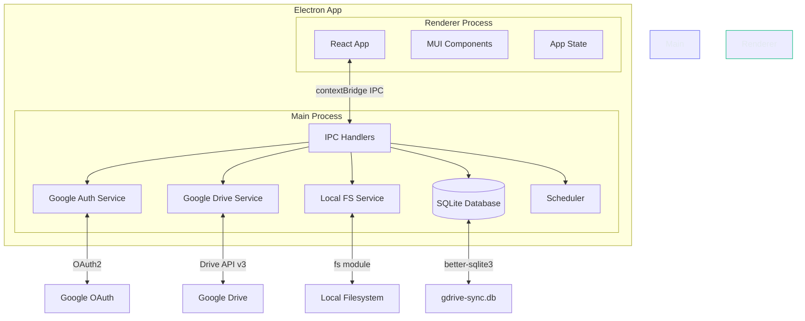
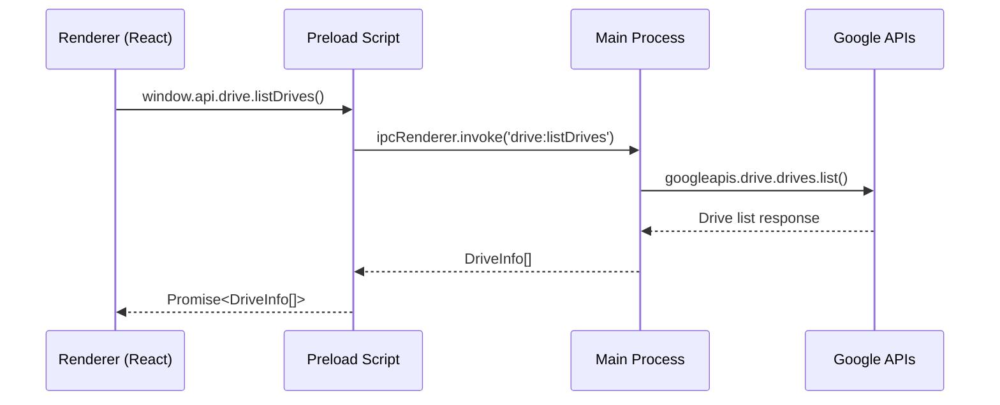
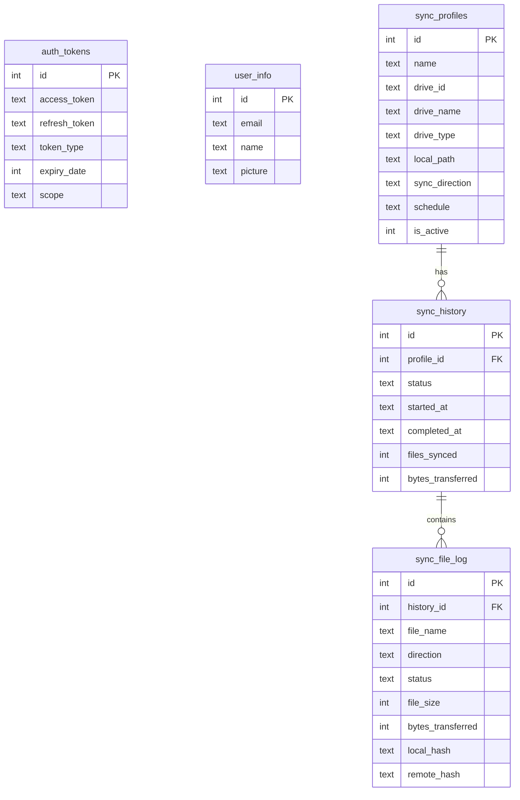

# Architecture

## High-Level Overview

GDrive Sync is an Electron desktop application with a React frontend and Node.js backend running in the same process. The app communicates with Google Drive via the official Google APIs.



## IPC Communication

The renderer process cannot access Node.js APIs directly (security). All communication goes through typed IPC channels via Electron's `contextBridge`.



### IPC Channel Map

| Channel | Direction | Description |
|---------|-----------|-------------|
| `auth:login` | Renderer → Main | Triggers OAuth flow in a modal window |
| `auth:logout` | Renderer → Main | Revokes tokens and clears database |
| `auth:getUser` | Renderer → Main | Returns cached user info |
| `auth:isLoggedIn` | Renderer → Main | Checks if valid tokens exist |
| `drive:listDrives` | Renderer → Main | Lists My Drive + shared drives |
| `drive:listFiles` | Renderer → Main | Lists files in a drive/folder |
| `localFs:listDirectory` | Renderer → Main | Lists local directory contents |
| `localFs:getHomeDir` | Renderer → Main | Returns user's home directory path |
| `localFs:selectDirectory` | Renderer → Main | Opens native folder picker dialog |
| `sync:*` | Renderer → Main | Sync profile CRUD and execution |
| `sync:progress` | Main → Renderer | Real-time sync progress updates |

## Database Schema



## Folder Structure

```
gdrive/
├── desktop/              # Electron main process (TypeScript)
│   ├── index.ts          # App entry, window creation
│   ├── preload.ts        # contextBridge API exposure
│   ├── ipc-handlers.ts   # IPC channel registration
│   └── services/
│       ├── google-auth.ts   # OAuth2 flow & token management
│       ├── google-drive.ts  # Google Drive API wrapper
│       ├── local-fs.ts      # Local filesystem operations
│       └── database.ts      # SQLite init & CRUD helpers
├── frontend/             # React renderer (TypeScript + Vite)
│   ├── index.html        # HTML shell
│   ├── main.tsx          # React entry point
│   ├── App.tsx           # Root component (auth routing)
│   ├── pages/
│   │   ├── Login.tsx     # OAuth login screen
│   │   └── Dashboard.tsx # Main dashboard
│   ├── components/
│   │   ├── Layout/Sidebar.tsx
│   │   ├── DriveTree/DriveTree.tsx
│   │   ├── LocalTree/LocalTree.tsx
│   │   └── SyncCards/SyncCards.tsx
│   └── theme/index.ts   # MUI dark theme
├── shared/               # Shared TypeScript types
│   └── types.ts          # IPC API types, data models
├── docs/                 # Architecture & setup documentation
├── scripts/              # Utility & test scripts
├── dist/                 # Build output (gitignored)
├── release/              # Packaged app (gitignored)
└── .github/workflows/    # CI/CD
```

## Technology Choices

| Component | Technology | Rationale |
|-----------|-----------|-----------|
| Desktop shell | Electron 33 | Cross-platform, mature ecosystem, native OS integration |
| UI framework | React 18 + MUI 5 | Component library, consistent design, dark theme |
| Build tool | Vite 6 | Fast HMR for renderer, instant dev server |
| Main process | TypeScript + tsc | Type safety, compiles to CommonJS for Node.js |
| Google APIs | googleapis npm | Official client library, OAuth2 built-in |
| Database | better-sqlite3 | Synchronous, fast, single-file, no server needed |
| Packaging | electron-builder | DMG/NSIS/AppImage output, auto-update support |
| Auto-update | electron-updater | GitHub Releases integration |
