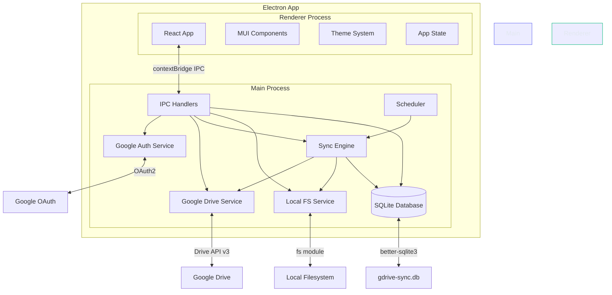
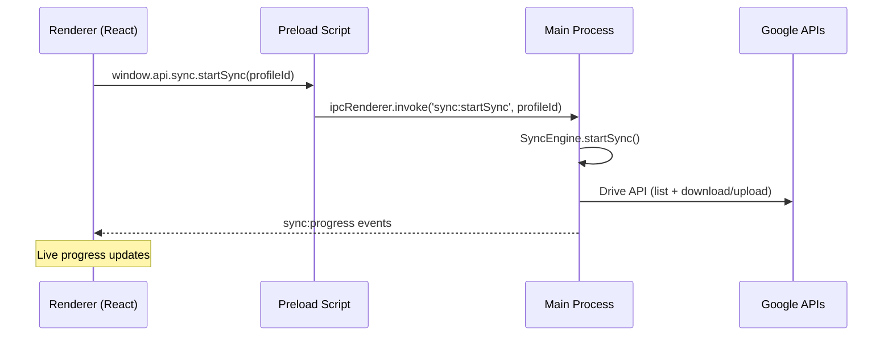
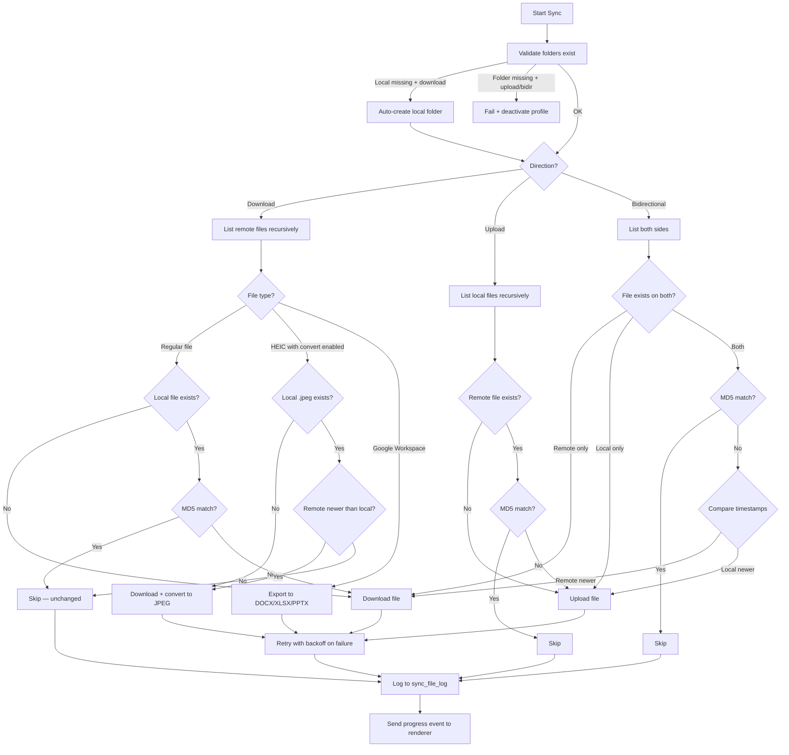
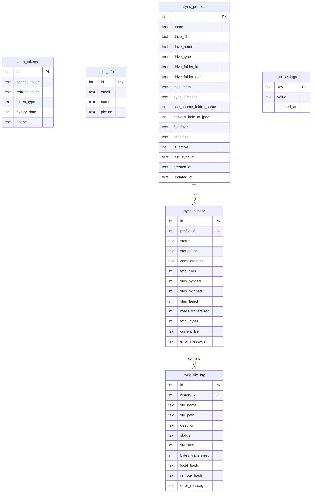

# Architecture

## High-Level Overview

GDrive Sync is an Electron desktop application with a React frontend and Node.js backend running in the same process. The app communicates with Google Drive via the official Google APIs.



## IPC Communication

The renderer process cannot access Node.js APIs directly (security). All communication goes through typed IPC channels via Electron's `contextBridge`.



### IPC Channel Map

| Channel | Direction | Description |
|---------|-----------|-------------|
| `auth:login` | Renderer -> Main | Triggers OAuth flow in a modal window |
| `auth:logout` | Renderer -> Main | Revokes tokens and clears database |
| `auth:getUser` | Renderer -> Main | Returns cached user info |
| `auth:isLoggedIn` | Renderer -> Main | Checks if valid tokens exist |
| `drive:listDrives` | Renderer -> Main | Lists My Drive + shared drives |
| `drive:listFiles` | Renderer -> Main | Lists files in a drive/folder |
| `localFs:listDirectory` | Renderer -> Main | Lists local directory contents |
| `localFs:getHomeDir` | Renderer -> Main | Returns user's home directory path |
| `localFs:selectDirectory` | Renderer -> Main | Opens native folder picker dialog |
| `sync:getProfiles` | Renderer -> Main | List all sync profiles |
| `sync:createProfile` | Renderer -> Main | Create a new sync profile |
| `sync:updateProfile` | Renderer -> Main | Update an existing profile |
| `sync:deleteProfile` | Renderer -> Main | Delete a sync profile |
| `sync:startSync` | Renderer -> Main | Begin/resume sync for a profile |
| `sync:cancelSync` | Renderer -> Main | Pause an active sync (partial files saved) |
| `sync:getSessions` | Renderer -> Main | Get sync history sessions |
| `sync:progress` | Main -> Renderer | Real-time sync progress updates |
| `backup:backup` | Renderer -> Main | Upload database to Google Drive |
| `backup:restore` | Renderer -> Main | Download and replace local database |
| `backup:syncMerge` | Renderer -> Main | Merge remote DB into local (last-write-wins) |
| `backup:getInfo` | Renderer -> Main | Get last backup timestamp |
| `app:getVersion` | Renderer -> Main | Get app version string |
| `app:checkForUpdates` | Renderer -> Main | Trigger auto-update check |
| `app:getPlatform` | Renderer -> Main | Get OS platform string |
| `app:getSetting` | Renderer -> Main | Read app setting from database |
| `app:setSetting` | Renderer -> Main | Write app setting to database |

## Sync Engine Flow



### Change Detection Strategy

| File Type | Comparison Method | Re-download When |
|-----------|------------------|-----------------|
| Regular files (PDF, JPG, etc.) | **MD5 hash** — Google provides `md5Checksum` in metadata, compared with locally computed hash | Hash mismatch (file changed on either side) |
| HEIC with conversion enabled | **modifiedTime** — compares remote HEIC timestamp vs local JPEG mtime | Remote HEIC newer than local JPEG |
| Google Workspace (Docs/Sheets/Slides) | **Always re-export** — Google doesn't provide MD5 for native formats | Every sync (exported to DOCX/XLSX/PPTX) |
| Deleted local files | **exists check** — `fs.existsSync()` returns false | File missing locally → re-downloaded |
| Partial downloads (.partial files) | **Resume via HTTP Range header** — continues from last byte | Paused transfer resumed |

### Safe Sync Mode

The sync engine **never deletes files** on either side. It only adds new files and updates existing ones.

- If a file is deleted locally → next sync re-downloads it from Drive
- If a file is deleted on Drive → local copy remains untouched
- No conflict resolution needed — newer version wins (by timestamp or hash)

### Google Workspace Export Map

| Google Native Type | Exported Format | Extension |
|-------------------|----------------|-----------|
| Google Docs | Word | .docx |
| Google Sheets | Excel | .xlsx |
| Google Slides | PowerPoint | .pptx |
| Google Drawings | PNG | .png |
| Google Jamboard | PDF | .pdf |
| Google Apps Script | JSON | .json |
| Google Forms | Not exported | Skipped |
| Google Sites | Not exported | Skipped |

### Retry Logic

Transient errors are retried up to 3 times with exponential backoff:
- Attempt 1: wait ~1s
- Attempt 2: wait ~2s
- Attempt 3: wait ~4s

Retryable errors: `ECONNRESET`, `ETIMEDOUT`, `ENOTFOUND`, HTTP 429 (rate limit), 500, 503.

## Database Schema



## Folder Structure

```
gdrive/
├── desktop/              # Electron main process (TypeScript)
│   ├── index.ts          # App entry, window creation, menu, auto-updater
│   ├── preload.ts        # contextBridge API exposure
│   ├── ipc-handlers.ts   # IPC channel registration (all try-catch wrapped)
│   └── services/
│       ├── google-auth.ts     # OAuth2 via system browser + local HTTP callback
│       ├── google-drive.ts    # Drive API: list, download (resumable), upload, export
│       ├── sync-engine.ts     # Sync: download/upload/bidir, retry, pause/resume, HEIC convert
│       ├── scheduler.ts       # node-cron auto-sync scheduler
│       ├── db-backup.ts       # DB backup/restore/merge to Google Drive
│       ├── embedded-config.ts # Load build-time OAuth + GH token config
│       ├── local-fs.ts        # Local filesystem operations
│       └── database.ts        # SQLite init, CRUD, settings, migrations
├── frontend/             # React renderer (TypeScript + Vite)
│   ├── index.html
│   ├── main.tsx          # Entry: AppThemeProvider + AppSettingsProvider
│   ├── App.tsx           # Auth routing with ErrorBoundary
│   ├── context/
│   │   └── AppSettingsContext.tsx  # Customizable app title
│   ├── pages/
│   │   ├── Login.tsx     # First-run setup + system browser OAuth
│   │   ├── Dashboard.tsx # Profile Command Center (master-detail layout)
│   │   ├── History.tsx   # Filterable, sortable history with bulk delete
│   │   ├── Settings.tsx  # Data dir, OAuth creds, backup, profiles, title, theme
│   │   └── About.tsx     # Feature cards, tech stack, update checker
│   ├── components/
│   │   ├── Layout/Sidebar.tsx          # Collapsible sidebar (4 nav items)
│   │   ├── StatsBar/StatsBar.tsx       # Aggregate sync metrics
│   │   ├── ProfileList/ProfileList.tsx # Master column with status indicators
│   │   ├── ProfileDetail/ProfileDetail.tsx  # Detail panel with config + activity
│   │   ├── EmptyState/EmptyState.tsx   # Onboarding for 0 profiles
│   │   ├── DriveTree/DriveTree.tsx     # Drive explorer (used in dialogs)
│   │   ├── LocalTree/LocalTree.tsx     # Local explorer (used in dialogs)
│   │   ├── CreateProfileDialog/        # Profile creation with embedded Drive picker
│   │   ├── EditProfileDialog/          # Profile editing with recursive folder picker
│   │   ├── ErrorBoundary/              # React error boundary
│   │   ├── StatusMessage/              # Classified error display
│   │   └── WelcomeSplash/              # First-run welcome dialog
│   └── theme/
│       ├── index.ts         # Re-exports
│       ├── themes.ts        # 5 themes (Midnight, GitHub Dark, Ocean, Sunset, Light)
│       └── ThemeContext.tsx  # Theme provider + localStorage persistence
├── shared/types.ts       # All TypeScript types + IPC API interface
├── resources/
│   ├── icon.png          # App icon (1024px)
│   └── icon.icns         # macOS icon
├── docs/                 # Architecture, OAuth setup, phases, cost tracking
├── scripts/
│   ├── release.sh        # Local build + GitHub Release upload
│   └── verify-build.sh
├── dist/                 # Build output (gitignored)
├── release/              # Packaged app (gitignored)
└── .github/workflows/    # CI/CD (GitHub Actions)
```

## Technology Choices

| Component | Technology | Rationale |
|-----------|-----------|-----------|
| Desktop shell | Electron 33 | Cross-platform, mature ecosystem, native OS integration |
| UI framework | React 18 + MUI 5 | Component library, consistent design, dark theme |
| Build tool | Vite 6 | Fast HMR for renderer, instant dev server |
| Main process | TypeScript + tsc | Type safety, compiles to CommonJS for Node.js |
| Google APIs | googleapis npm | Official client library, OAuth2 built-in |
| Database | better-sqlite3 | Synchronous, fast, single-file, no server needed |
| Image conversion | sharp | HEIC to JPEG conversion for synced photos |
| Scheduling | node-cron | Standard cron expression support |
| Packaging | electron-builder | ZIP output for macOS, auto-update support |
| Auto-update | GitHub API + in-app download | Version check + download with progress |
| Themes | Custom MUI ThemeProvider | 5 themes with localStorage persistence |
| Auth | System browser + local HTTP server | Standard desktop OAuth (VS Code, gcloud pattern) |

## Data Storage

### Database Location

The app stores its SQLite database in a configurable data directory:

| Platform | Default Path |
|----------|-------------|
| macOS | `~/Library/Application Support/gsync/` |
| Windows | `%APPDATA%/gsync/` |
| Linux | `~/.config/gsync/` |

The config file `~/.gsync/config.json` overrides the default:

```json
{
  "dataDir": "/Users/yourname/your/preferred/path"
}
```

### Database Files

| File | Purpose | Safe to delete? |
|------|---------|----------------|
| `gdrive-sync.db` | Main database — profiles, tokens, settings, sync history | No — all data is here |
| `gdrive-sync.db-wal` | Write-ahead log — buffered writes for performance | No while app is running. Merges into .db on clean shutdown |
| `gdrive-sync.db-shm` | Shared memory — coordinates WAL access | No while app is running. Auto-recreated on next launch |

### Pre-configure on New Machine

Before first launch, set the data directory so the app creates its database in the right place:

```bash
mkdir -p ~/.gsync
echo '{"dataDir":"/your/preferred/path"}' > ~/.gsync/config.json
```

Then restore a database backup (from Settings > Database Backup > Restore from Drive) to recover all profiles, history, and settings.

### Backup & Restore

The database can be backed up to Google Drive and restored on any machine:
- **Backup**: uploads `gdrive-sync-backup.db` to `GDrive Sync Backups/` folder on Drive
- **Restore**: downloads backup, creates safety copy (`.pre_restore_*`), replaces local DB
- **Sync-Merge**: merges remote and local DBs using last-write-wins by `updated_at` timestamp
