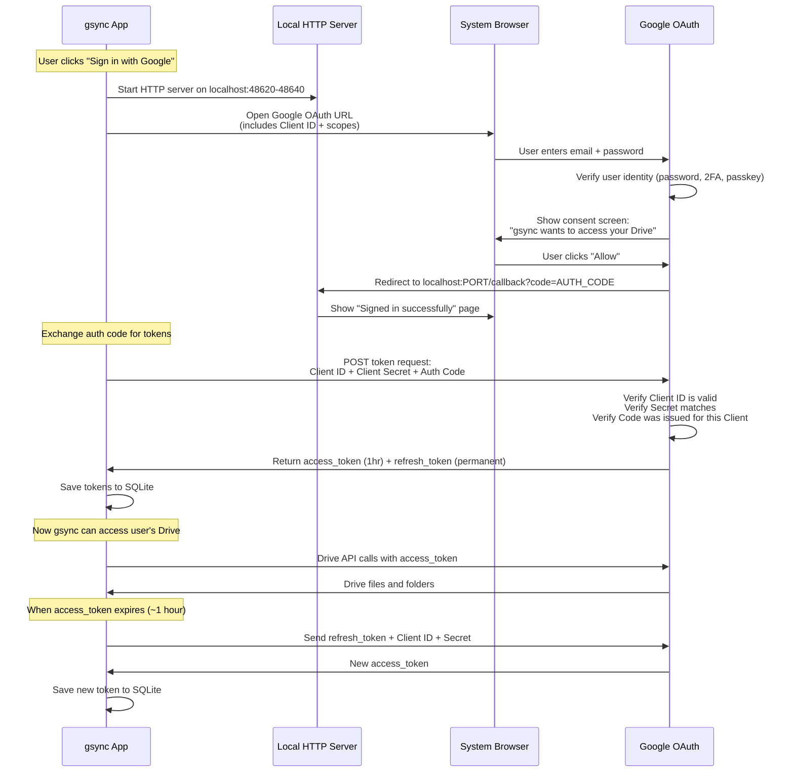
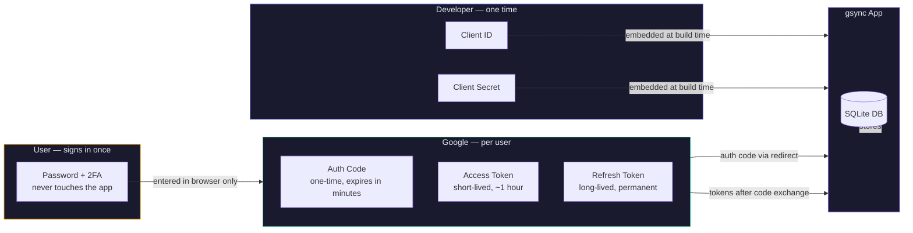
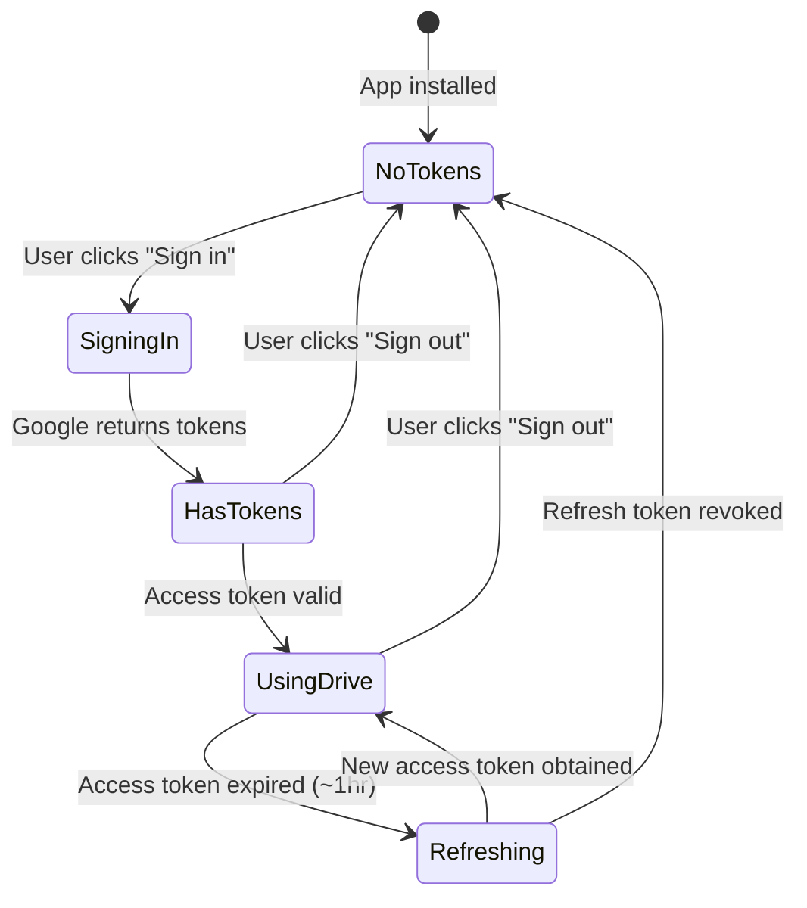

# Google OAuth Setup & Authentication Flow

## How Authentication Works

gsync uses Google's OAuth 2.0 protocol to access Google Drive on behalf of each user. There are two sets of credentials involved:

| Credential | Belongs to | Created by | Purpose |
|-----------|-----------|------------|---------|
| **Client ID + Secret** | The app (gsync) | Developer (one-time) | Identifies gsync to Google — "this request is from gsync" |
| **Access Token + Refresh Token** | Each user | Google (after user approves) | Grants gsync access to that user's Drive |

The Client ID and Secret are embedded in the app at build time. Users never need to see or enter them. Each user signs in with their own Google account and gets their own tokens.

## Authentication Flow



## Who Provides What



## Token Lifecycle



## Security Model

- **User's password** never touches gsync — it's entered directly in Google's page in the system browser
- **Client Secret** is embedded in the app binary — Google classifies desktop apps as "public clients" and accounts for this. The real security is the user clicking "Allow" on Google's consent screen
- **Tokens are stored locally** in SQLite on the user's machine — never transmitted to any server other than Google
- **Refresh tokens** can be revoked by the user at any time via Google Account settings → Security → Third-party apps
- **Safe sync mode** — even with full Drive access tokens, gsync never deletes files

## Prerequisites

- A Google Cloud Platform account
- A GCP project ([console.cloud.google.com](https://console.cloud.google.com))

## Developer Setup (One Time)

### 1. Enable the Google Drive API

1. Go to **APIs & Services > Library**
2. Search for "Google Drive API"
3. Click **Enable**

### 2. Configure OAuth Consent Screen

1. Go to **APIs & Services > OAuth consent screen**
2. Select **External** user type (or Internal for Workspace orgs)
3. Fill in:
   - App name: `gsync`
   - User support email: your email
   - Developer contact: your email
4. Add scopes:
   - `https://www.googleapis.com/auth/drive`
   - `https://www.googleapis.com/auth/userinfo.email`
   - `https://www.googleapis.com/auth/userinfo.profile`
5. Add test users (anyone who needs to sign in while app is in Testing mode)

### 3. Create OAuth Credentials

1. Go to **APIs & Services > Credentials**
2. Click **Create Credentials > OAuth 2.0 Client ID**
3. Application type: **Desktop app**
4. Name: `gsync`
5. Click **Create**
6. Copy the **Client ID** and **Client Secret**

### 4. Configure for Development

Create a `.env` file in the project root:

```env
GOOGLE_CLIENT_ID=your-client-id.apps.googleusercontent.com
GOOGLE_CLIENT_SECRET=GOCSPX-your-secret
GSYNC_UPDATE_TOKEN=github_pat_your-token  # optional, for auto-updates
```

### 5. Configure for CI/CD

Add as GitHub repository secrets:
- `GOOGLE_CLIENT_ID`
- `GOOGLE_CLIENT_SECRET`
- `GSYNC_UPDATE_TOKEN` (optional)

These are embedded into the app at build time via `dist/oauth-config.json`.

### 6. Add Test Users

Until your app passes Google's OAuth verification review:
- Go to **OAuth consent screen > Test users**
- Add each user's email
- Maximum 100 test users
- Users not in this list will see "Access blocked"

## User Experience

For end users who download the packaged app:

1. Open gsync
2. Click **"Sign in with Google"**
3. Browser opens → sign in with their Google account → click Allow
4. Browser shows "Signed in successfully — you can close this tab"
5. gsync loads their Drive

No credentials to enter, no setup required.

## Troubleshooting

| Issue | Solution |
|-------|----------|
| "Access blocked" | User's email not in test users list. Add in OAuth consent screen. |
| "invalid_client" | Client ID or Secret is wrong. Check Settings > Google OAuth Credentials. |
| "redirect_uri_mismatch" | Ensure OAuth client type is Desktop app (not Web). |
| Token refresh fails | Sign out and sign in again. Refresh tokens can be invalidated by Google. |
| "API not enabled" | Enable Google Drive API in GCP Console > APIs & Services > Library. |
| Stuck on passkey screen | System browser handles this natively. Choose password if passkey fails. |
