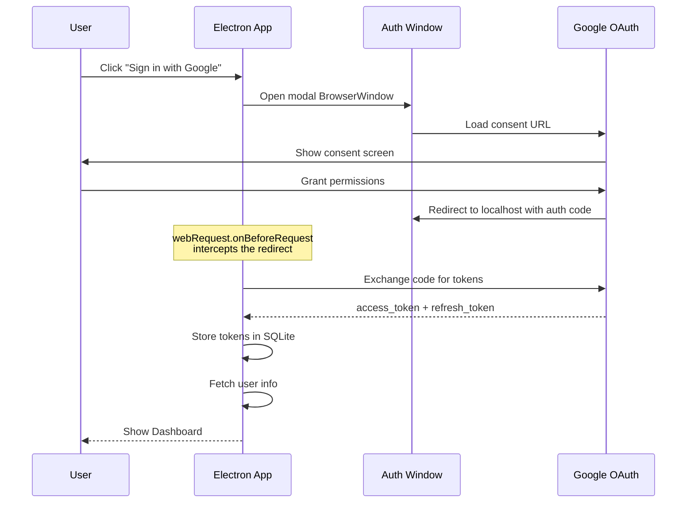

# Google OAuth Setup Guide

## Prerequisites

- A Google Cloud Platform account
- A GCP project (create one at [console.cloud.google.com](https://console.cloud.google.com))

## Step-by-Step Setup

### 1. Enable the Google Drive API

1. Go to **APIs & Services > Library**
2. Search for "Google Drive API"
3. Click **Enable**

### 2. Configure OAuth Consent Screen

1. Go to **APIs & Services > OAuth consent screen**
2. Select **External** user type (or Internal if using Workspace)
3. Fill in the required fields:
   - App name: `GDrive Sync`
   - User support email: your email
   - Developer contact: your email
4. Add scopes:
   - `https://www.googleapis.com/auth/drive`
   - `https://www.googleapis.com/auth/userinfo.email`
   - `https://www.googleapis.com/auth/userinfo.profile`
5. Add your Google account as a test user (if External)

### 3. Create OAuth Credentials

1. Go to **APIs & Services > Credentials**
2. Click **Create Credentials > OAuth 2.0 Client ID**
3. Application type: **Desktop app**
4. Name: `GDrive Sync Desktop`
5. Click **Create**
6. Copy the **Client ID** and **Client Secret**

### 4. Configure the Application

Create a `.env` file in the project root:

```env
GOOGLE_CLIENT_ID=your-client-id-here.apps.googleusercontent.com
GOOGLE_CLIENT_SECRET=your-client-secret-here
```

### OAuth Flow Diagram



## Troubleshooting

| Issue | Solution |
|-------|----------|
| "Access blocked" error | Add your account as a test user in OAuth consent screen |
| "redirect_uri_mismatch" | Ensure Desktop app type is selected (not Web) |
| Token refresh fails | Re-authenticate; refresh tokens can be invalidated |
| "API not enabled" | Enable Google Drive API in GCP Console |
