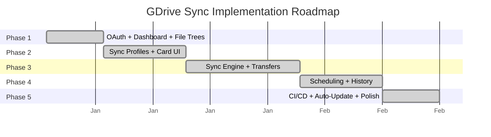

# Implementation Phases

## Phase Overview

## Phase 1: Authentication & Dashboard

**Goal:** Working Electron app with Google OAuth and drive/file browsing.

**Deliverables:**
- Electron app shell with macOS-native look (hidden titlebar, traffic lights)
- Google OAuth2 login flow via modal BrowserWindow
- Token storage in SQLite with auto-refresh
- Dashboard with sidebar navigation
- Google Drive tree (My Drive + shared drives with permission badges)
- Local filesystem tree with breadcrumb navigation
- Dark theme with Inter font

**Status:** Complete

---

## Phase 2: Sync Profile Creation & Card UI

**Goal:** Users can create sync profiles and see them rendered as cards.

**Deliverables:**
- Sync profile creation dialog (select drive folder + local folder + direction)
- Auto-detect sync direction based on drive permissions (read-only = download only)
- Card-based sync profile display with horizontally scrolling cards
- Card states with glowing pulse animation for in-progress syncs
- Linear progress bar overlay on active cards
- Start/delete sync from card
- Schedule selector in profile creation (15m/30m/hourly/6h/daily/weekdays)

**Status:** Complete

---

## Phase 3: Sync Engine

**Goal:** Actual file synchronization with progress tracking.

**Deliverables:**
- Streaming file downloads from Google Drive
- Streaming file uploads to Google Drive
- MD5 hash checksum comparison for change detection (skip unchanged files)
- Per-file progress reporting via IPC events
- Google Workspace file export (Docs->DOCX, Sheets->XLSX, Slides->PPTX, Drawings->PNG)
- Bidirectional sync with timestamp-based conflict resolution (newer wins)
- Sync history and per-file logs persisted in SQLite
- Cancellation support via IPC

**Status:** Complete

---

## Phase 4: Scheduling & Activity History

**Goal:** Automated sync schedules and comprehensive activity tracking.

**Deliverables:**
- node-cron based scheduler: auto-syncs profiles on cron schedules
- Scheduler initializes on app start, refreshes when profiles change
- Activity History page with table view: status, duration, file counts, bytes, errors
- Live progress updates in History page via sync:progress events
- Schedule badge displayed on profile cards

**Status:** Complete

---

## Phase 5: CI/CD & Auto-Update & Polish

**Goal:** Automated builds, seamless updates, and visual polish.

**Deliverables:**
- GitHub Actions workflow: matrix build for macOS/Windows/Linux
- Build artifacts uploaded and released via GitHub Releases
- `electron-updater` integration for in-app update check
- Version and platform display in Settings
- "Check for Updates" button in Settings
- Multi-theme system: 6 themes (Midnight, GitHub Dark, Dracula, Nord, One Dark Pro, Light)
- Theme selector with mini preview cards in Settings
- Theme persistence via localStorage

**Status:** Complete
