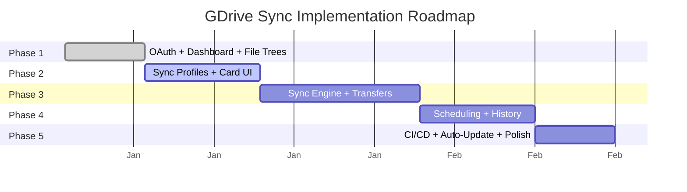

# Implementation Phases

## Phase Overview

## Phase 1: Authentication & Dashboard (Current)

**Goal:** Working Electron app with Google OAuth and drive/file browsing.

**Deliverables:**
- Electron app shell with macOS-native look (hidden titlebar, traffic lights)
- Google OAuth2 login flow via modal BrowserWindow
- Token storage in SQLite with auto-refresh
- Dashboard with sidebar navigation
- Google Drive tree (My Drive + shared drives with permission badges)
- Local filesystem tree with breadcrumb navigation
- Dark theme with Inter font

**Status:** Complete

---

## Phase 2: Sync Profile Creation & Card UI

**Goal:** Users can create sync profiles and see them rendered as cards.

**Deliverables:**
- Sync profile creation dialog (select drive folder + local folder + direction)
- Auto-detect sync direction based on drive permissions (read-only → download only)
- Card-based sync profile display
- Card states with visual indicators:
  - Idle: neutral border
  - In progress: glowing animated border (primary color)
  - Completed: green border, checkmark
  - Failed: red border, error details
- Start/pause/cancel sync from card

---

## Phase 3: Sync Engine

**Goal:** Actual file synchronization with progress tracking.

**Deliverables:**
- Chunked file downloads (5-10MB chunks, resumable)
- Chunked file uploads (resumable via Google API)
- MD5 hash checksum comparison for change detection
- File-level progress tracking (bytes transferred, speed, ETA)
- Resumable sync (pick up where it left off after failure)
- Sync file log in database for each file transferred
- Parallel transfers for small files
- Google Workspace file export (Docs → DOCX, Sheets → XLSX, etc.)

---

## Phase 4: Scheduling & Activity History

**Goal:** Automated sync schedules and comprehensive activity tracking.

**Deliverables:**
- Cron-like scheduling per sync profile (e.g., "every 2 hours")
- File system watcher for real-time local change detection
- Activity history page with filterable log
- Sync session details (files synced, bytes, duration, errors)
- Conflict resolution dialog (keep newer, keep both, preview diff)
- Deletion confirmation prompts (never auto-delete)

---

## Phase 5: CI/CD & Auto-Update

**Goal:** Automated builds and seamless update experience.

**Deliverables:**
- GitHub Actions workflow: single job per platform (macOS, Windows, Linux)
- Build artifacts as GitHub Release assets
- `electron-updater` integration for in-app update notifications
- Auto-download and install updates
- Version display in settings
- Update check on app launch
